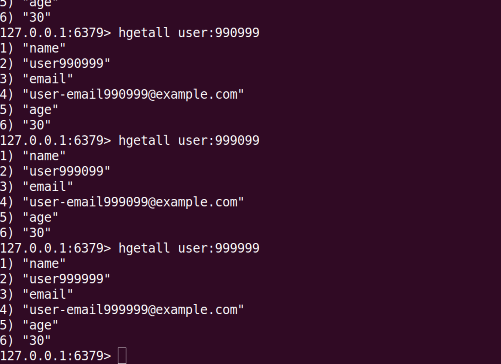

- Redis playaround repo.
- Caching user profile info into a local docker container.
- Time taken for creating and retrieving 1 million entries: 230119.69 ms (~4 mins)

While it took hours to do the same in postgres. 
(Not really comparing because use cases are different, but we get the point that redis is great for caching).